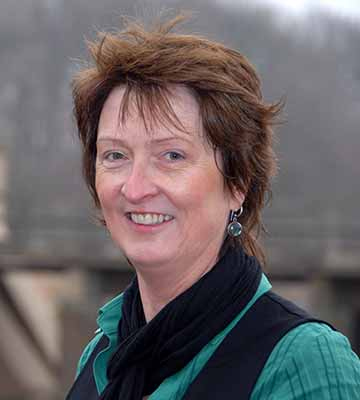

# Über mich

Mein Name ist Mary O'Keeffe. Ich bin im Süd-Westen Irlands aufgewachsen und lebe
nun seit über 25 Jahren in Deutschland.

In all diesen Jahren habe ich Berlin, Hessen und NRW meine Heimat nennen dürfen.

Es hat mir schon immer Freude bereitet eine "Botschafterin Irlands" zu sein.

Diese Freude hat mich dazu inspiriert *irische Kochkurse*, *Präsentationen* und
*Gruppenreisen* zu veranstalten.
